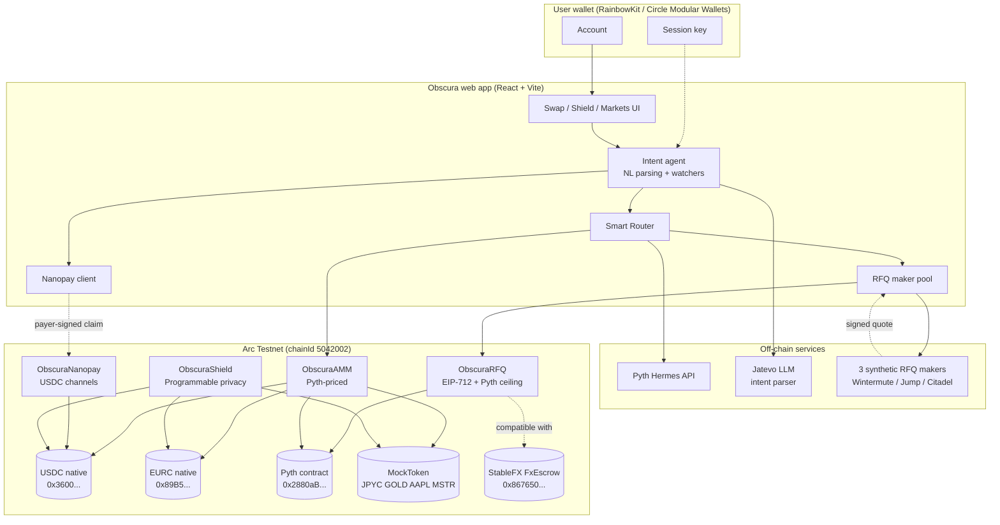
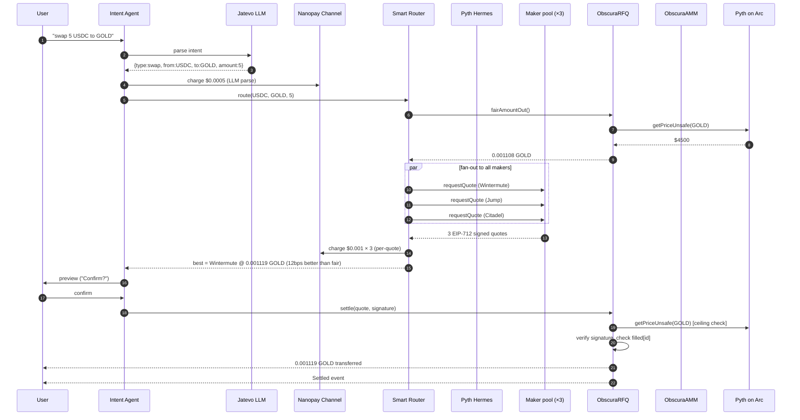
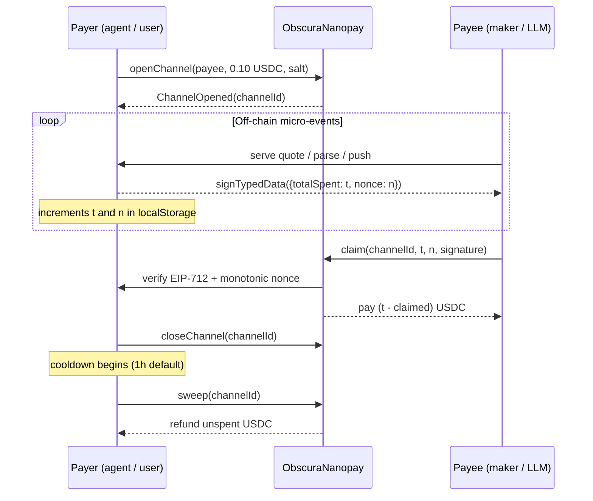

# Obscura — System Architecture

> **Track**: Best Agentic Economy Experience on Arc
> **Tagline**: An autonomous stablecoin agent that researches, negotiates, and settles trades on Arc using oracle-bounded RFQ, USDC nanopayments, and programmable session keys.

This document is the architecture deliverable for the Stablecoin Commerce Stack Challenge. Read top-to-bottom for the full picture, or jump to a specific layer:

- [System diagram](#system-diagram)
- [Component contracts](#component-contracts)
- [Data flow: Agent-driven swap](#data-flow-agent-driven-swap)
- [Data flow: Nanopayment lifecycle](#data-flow-nanopayment-lifecycle)
- [Circle integration map](#circle-integration-map)
- [Security model](#security-model)

---

## System diagram

---

## Component contracts

| Contract | Purpose | Key feature for Track 4 |
|---|---|---|
| **ObscuraAMM** | USDC-quoted constant-fee AMM, prices from Pyth | Lets the agent fall back to deterministic pricing when no maker is online |
| **ObscuraRFQ** | EIP-712 maker quotes with on-chain Pyth ceiling | Agent autonomously settles signed quotes; deviation cap means a compromised maker can't rug the agent |
| **ObscuraShield** | Privacy pool with Low/Medium/High lock windows | Agent can park strategy USDC out of front-running view |
| **ObscuraNanopay** | USDC payment channels for sub-cent billing | Agent pays per-quote, per-LLM-call, per-Pyth-push without on-chain cost per micro-event |
| **MockToken** | Faucet-enabled ERC-20 for synthetic markets | Demo-friendly without burning real testnet supply |

All contracts are deployed to Arc Testnet — see `deployments/arc-testnet.json` for the addresses.

---

## Data flow: Agent-driven swap

This is the canonical Track 4 demo: a user types a natural-language intent, and the agent autonomously researches multiple makers, picks the best, charges itself for the discovery work, and settles on-chain — all in a single user click.

What's "agentic" here:
1. The LLM call, the maker fan-out, the Pyth check, and the on-chain settlement are all coordinated by Obscura's agent without per-step user clicks.
2. The agent pays for its own work (LLM call + 3 quote requests = ~$0.0035) via Nanopay, demonstrating **pay-per-inference economics at sub-cent granularity**.
3. The user only signs once (the final settlement). Prior to that, every micro-event is signed by the agent's session key.

---

## Data flow: Nanopayment lifecycle

Why this matters for Track 4:
- **Sub-cent rates**: 0.001 USDC / quote is **literally 1 / 1000th of a cent on Arc** (gas-free off-chain signing + batched on-chain settlement).
- **No funds at risk**: the channel is escrowed in `ObscuraNanopay`, not held by the maker.
- **Monotonic nonce**: replay protection without timestamps.

---

## Circle integration map

| Circle product | How Obscura uses it | Status |
|---|---|---|
| **USDC** | Native gas + AMM quote token + Shield deposit asset + Nanopay channel currency | ✅ Deep integration |
| **EURC** | Real Arc-native EUR stablecoin, paired in AMM and RFQ | ✅ Deep integration |
| **Modular Wallets** | Passkey-secured smart accounts on Arc Testnet. Users create a wallet via WebAuthn, and `paymaster: true` sponsors gas through Circle Gas Station so swaps + RFQ settles cost the user **0 native USDC**. Adapter at `src/lib/circleWallet.ts`. | ✅ Built — connect button at top-right alongside RainbowKit |
| **Nanopayments** | Custom-built `ObscuraNanopay.sol` channel contract — agent pays per quote / per LLM parse / per Pyth push at sub-cent rates | ✅ Built + tested |
| **CCTP / Bridge Kit** | Future: agent claims USDC from Base/Ethereum, bridges to Arc, then trades | 🔵 Architecture-level |
| **StableFX FxEscrow** | Stablecoin pairs (USDC/EURC/JPYC) eligible for FxEscrow institutional settlement; Obscura's RFQ uses the same pattern | 🟡 Conceptual + UI badge |
| **USYC** | Future: idle Shield balance auto-allocates to USYC for yield | 🔵 Architecture-level |
| **Gateway** | Future: agent treasury routing | 🔵 Architecture-level |

Stack 1 (USDC + EURC + Nanopay) is fully built and tested. The rest are architecture-level integrations described in this document, in line with the rules: *"teams will not be penalized for building conceptual or architecture-level integrations if access is not granted."*

---

## Security model

### Threats and mitigations

| Threat | Mitigation |
|---|---|
| Compromised RFQ maker key signs absurd quote | `ObscuraRFQ.maxDeviationBps` rejects quotes more than ±2% from Pyth |
| Maker replays quoteId | `filled[quoteId]` mapping; one-shot per quote |
| Stale quote | EIP-712 message includes `expiry`; contract enforces `block.timestamp <= expiry` |
| Pyth feed staleness | `swapWithPriceUpdate` lets the user push fresh Hermes data + pay the tiny fee |
| Reentrancy in AMM/Shield/Nanopay/RFQ | Inline `nonReentrant` modifier on all entry points |
| Inverted feed precision loss (USD/JPY → JPY/USD) | High-precision invert keeps 18-digit precision regardless of source expo |
| Nanopay nonce regression | `lastNonce` strictly increasing per channel |
| Nanopay payee griefing payer | `closeChannel` + cooldown + `sweep` reclaims unspent funds |

### Key custody

- **EOA wallet (RainbowKit)**: standard MetaMask / WalletConnect / Coinbase. Default for users that already have a Web3 wallet.
- **Smart Contract Account (Circle Modular Wallets)**: passkey-secured. Created via `register` button in the header; first-time users get a WebAuthn-backed wallet without seed phrases. Gas is sponsored by Circle Gas Station via `paymaster: true`, so the user can swap and shield with **zero native USDC** — the smart account itself doesn't even need to be pre-funded for gas. Account is lazily deployed on the first user operation.
- **Agent session key**: derived from `VITE_RFQ_MAKER_PRIVATE_KEY` (demo only). Used to sign EIP-712 RFQ quotes and Nanopay claim messages. In production, this would be issued by Circle Modular Wallets with passkey-protected enrollment and a per-day spending cap. The current scope keeps it as an EOA because `ObscuraRFQ` and `ObscuraNanopay` use `ecrecover`; switching to ERC-1271 (`isValidSignature`) is a documented future-work item.
- **Maker keys**: 3 synthetic makers derived from the same seed (demo only). Production = each maker runs their own HSM.

### Access control

- `ObscuraAMM.listAsset`, `setMaker`, `setLevelLock`: owner-only (deployer)
- `ObscuraRFQ.setMaker`, `setMaxDeviationBps`: owner-only
- `ObscuraNanopay.setCooldown`: owner-only
- All state-mutating user functions: open

---

## File map (for the judging panel)

| Layer | Files |
|---|---|
| Solidity | `contracts/ObscuraAMM.sol`, `ObscuraRFQ.sol`, `ObscuraShield.sol`, `ObscuraNanopay.sol`, `MockToken.sol`, `MockPyth.sol`, `interfaces/*` |
| Deploy | `scripts/deploy.cjs`, `scripts/seedLiquidity.cjs`, `scripts/verify.cjs` |
| Tests | `test/Obscura.test.cjs` (23 cases) |
| Frontend (config) | `src/config/arc.ts`, `dexConfig.ts`, `rfqConfig.ts`, `nanopayConfig.ts`, `shieldConfig.ts`, `priceFeeds.ts` |
| Frontend (hooks) | `src/hooks/useAMMQuote.ts`, `useSmartRoute.ts`, `usePythSwap.ts`, `useTokenApproval.ts`, `useCircleWallet.tsx` |
| Frontend (lib) | `src/lib/rfqMaker.ts`, `nanopayClient.ts`, `priceOracle.ts`, `pythClient.ts`, `parseSwapIntent.ts`, `circleWallet.ts` |
| Frontend (UI) | `src/features/swap/SwapTab.tsx`, `SwapAgent.tsx`, `NanopayBadge.tsx`, `shield/ShieldTab.tsx`, `components/CircleWalletButton.tsx` |
